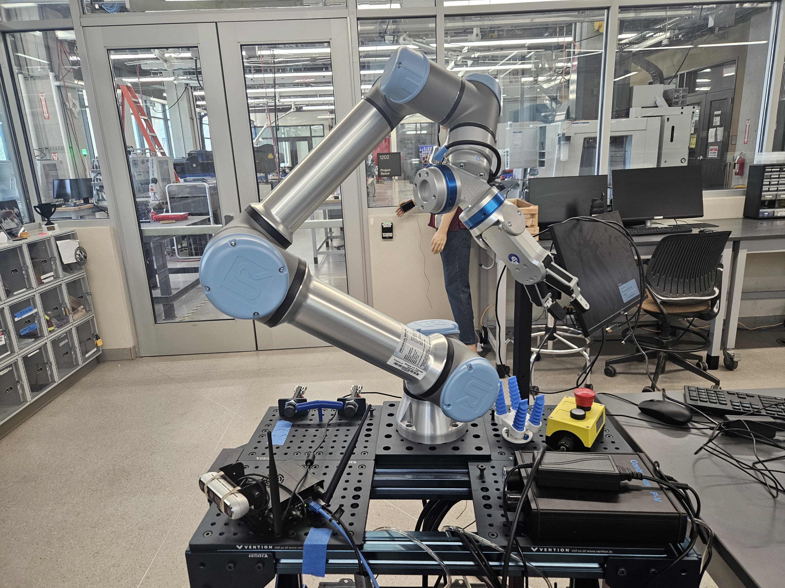

# UR7e ROS2 Keyboard Controller
<p align="center">
  
</p>
A minimal, reliable keyboard-based teleoperation system for controlling a **Universal Robots UR7e** using **ROS2 (Humble)** on a **Jetson Orin Nano**.

This project provides a low-latency, action-based control interface for jogging individual robot joints safely and interactively.

---

## 🚀 System Overview

```

Laptop (SSH + Dev)
│
│ WiFi (Hotspot)
│
Jetson Orin Nano (ROS2 + UR Driver)
│
│ Ethernet
│
Universal Robots UR7e

````

---

## 🔧 Features

- ✅ Keyboard-based joint jogging
- ✅ Uses `FollowJointTrajectory` action (robust + feedback-based)
- ✅ Automatically maps joint order from `/joint_states`
- ✅ Safe incremental motion (relative control)
- ✅ Prevents overlapping commands
- ✅ Adjustable step size in real-time
- ✅ Sends proper trajectory with start + goal (avoids tolerance errors)

---

## 🧠 Key Design Decisions

This controller avoids common UR ROS2 issues:

| Problem | Solution |
|--------|---------|
| Joint order mismatch | Dynamically maps joint names |
| Path tolerance errors | Sends current pose as first trajectory point |
| Silent failures | Uses action interface with feedback |
| Unsafe jumps | Uses small incremental steps |

---

## 📦 Requirements

### Hardware
- Jetson Orin Nano
- Universal Robots UR7e
- Ethernet cable
- Laptop (for SSH + control)

### Software
- Ubuntu 20.04 / 22.04 (Jetson)
- ROS2 Humble
- Universal Robots ROS2 Driver

---

## ⚙️ Installation

### 1. Clone the repository

```bash
cd ~/ur_ws/src
git clone <your-repo-url>
````

---

### 2. Build the workspace

```bash
cd ~/ur_ws
source /opt/ros/humble/setup.bash
colcon build --packages-select ur_dev_bringup --symlink-install
```

---

### 3. Source the workspace

```bash
source ~/ur_ws/install/setup.bash
```

---

## 🤖 Launch UR Driver

```bash
ros2 launch ur_robot_driver ur_control.launch.py \
ur_type:=ur7e \
robot_ip:=192.168.56.101
```

---

## ▶️ Start Robot Program

On the UR teach pendant:

1. Open **External Control program**
2. Press **▶ Play**

---

## 🎮 Run Keyboard Teleop

```bash
ros2 run ur_dev_bringup keyboard_teleop
```

---

## ⌨️ Controls

```
q/a : shoulder_pan_joint     + / -
w/s : shoulder_lift_joint    + / -
e/d : elbow_joint            + / -
r/f : wrist_1_joint          + / -
t/g : wrist_2_joint          + / -
y/h : wrist_3_joint          + / -

z   : decrease step size
x   : increase step size
space: print joint positions
c   : resend hold position
ESC : quit
```

---

## 🧪 First Test (IMPORTANT)

1. Press:

   ```
   space
   ```

   → confirm joint values are printed

2. Press:

   ```
   q
   ```

   → robot should move slightly

3. Press:

   ```
   a
   ```

   → robot should move back

---

## 🛠 Troubleshooting

### Robot not moving?

Check:

```bash
ros2 control list_controllers
```

You need:

```
scaled_joint_trajectory_controller   active
```

---

### Action not available?

```bash
ros2 action list
```

You should see:

```
/scaled_joint_trajectory_controller/follow_joint_trajectory
```

---

### No motion but goal accepted?

Check on robot:

* ✅ External Control program running
* ✅ Robot in Remote Control mode
* ✅ No protective stop
* ✅ Speed slider > 0%

---

### Joint mismatch errors?

This project already solves that by mapping joint names dynamically.

---

## 🧩 Project Structure

```
ur_dev_bringup/
 ├── keyboard_teleop.py
 ├── robot_state_node.py
 ├── camera_view_node.py
 └── launch/
```

---